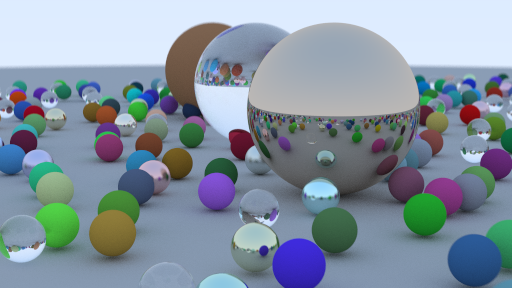
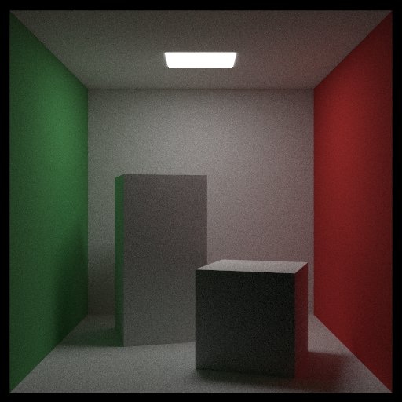
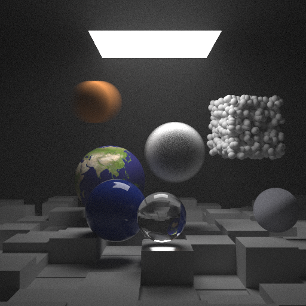

# Ray-tracing in Rust
This is a simple ray-tracer written in Rust.

It is based on the book ["Ray Tracing in One Weekend"](https://raytracing.github.io/) by Peter Shirley.

1st weekend project and 2nd week project are implemented.


## Deliverables

The output of the first week project is



The outputs of the second week project are





## How to run

```bash
cargo run --release --features execution
```
